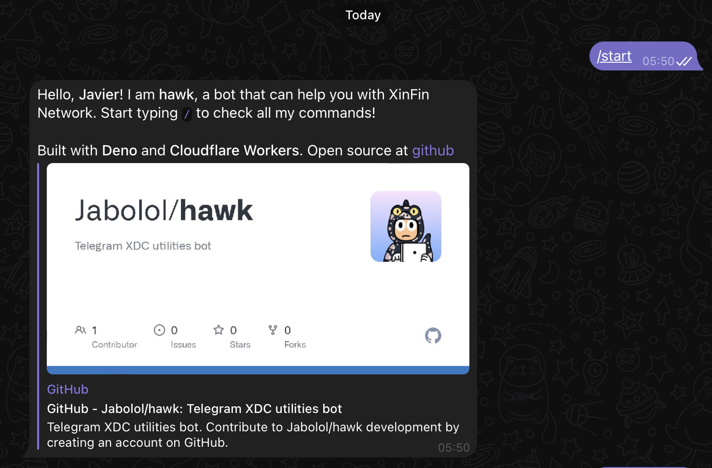
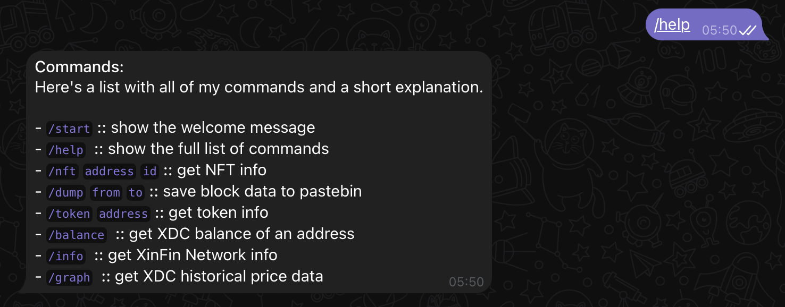
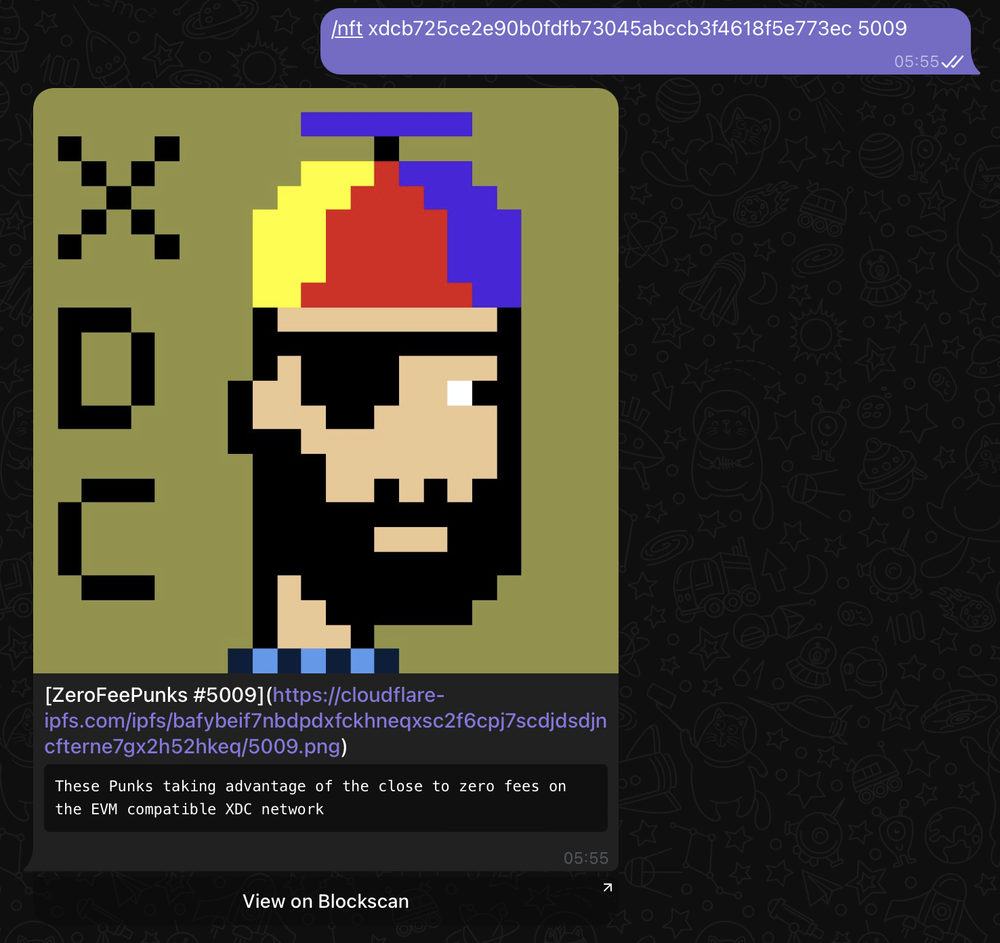
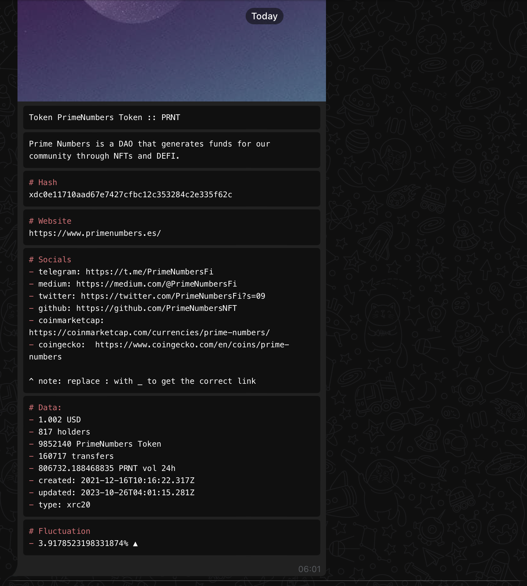
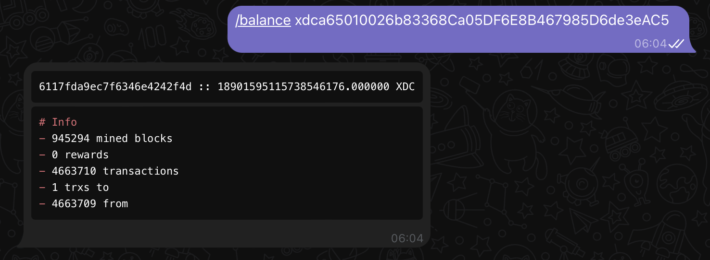
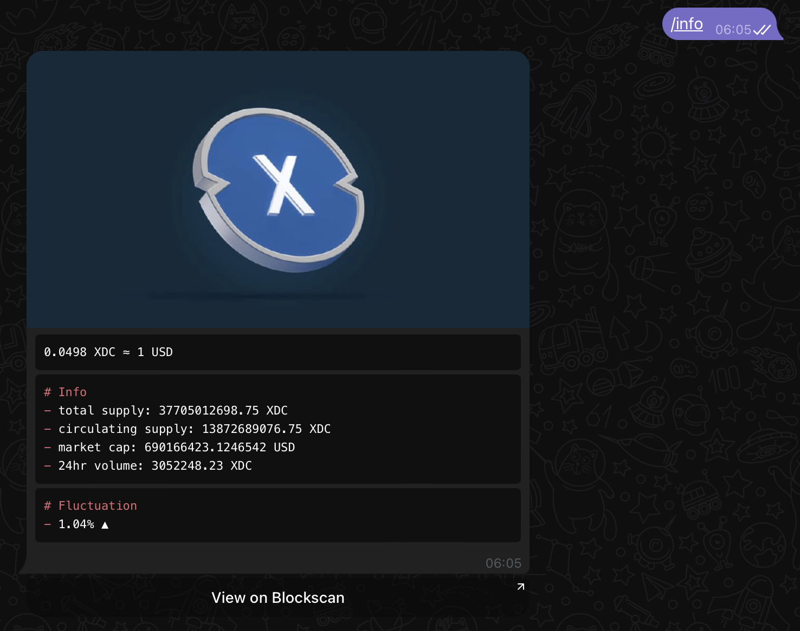
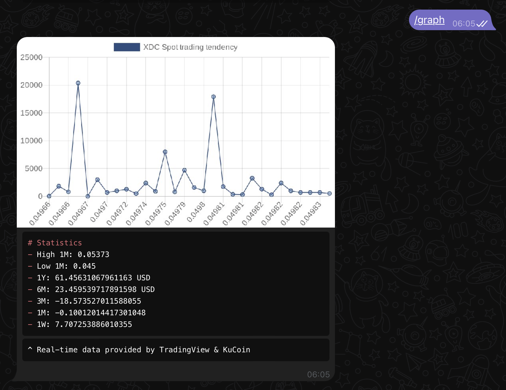
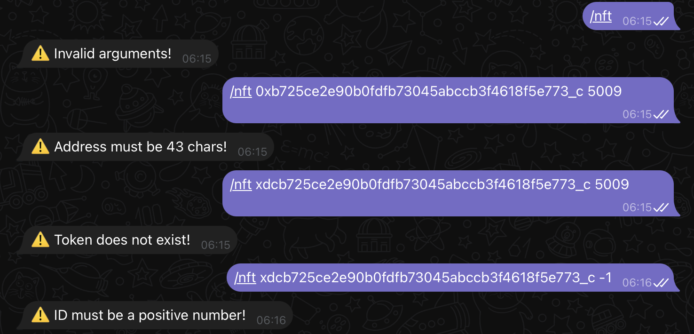

# hawk

**Hawk** is a multi-purpose Telegram crypto bot. Its main purpose is to provide
a simple way to get crypto prices and charts on Telegram, as well as to manage
different statistics and alerts on the [`XDC`](https://xdc.network/) network.

You can invite **hawk** by clicking [here](https://t.me/xdc_hawk_bot) and enjoy
the following features:

- Employ the NFT `viewer` feature for an instant NFT preview right.
- Seamlessly export blockchain `blocks` to the pastebin.
- Access real-time statistics on trading prices with the `spot` trading feature.
- Delve into comprehensive `details` and perform lookups for XDC tokens.
- Instantly retrieve address details and check the `balance`.

It is built with [Deno](https://deno.land/) and
[Cloudflare Workers](https://workers.cloudflare.com/). It is also powered by
[Telegram](https://telegram.org/) and [XinFin](https://xinfin.org/).

## index

- [commands](#commands)
- [features](#features)
- [setup](#setup)
- [contributing](#contributing)
- [license](#license)

## commands

### start

```sh
/start
```

Shows the welcome message. This message includes a brief description of the bot
and a link to the source code. It also includes the technology stack used to
build the bot.



### help

```sh
/help
```

Shows the help message. This message includes a list of all the available
commands and a brief description of each one of them.



### nft

```sh
/nft <address> <id>
```

Queries the **XDC** network for the details of a given NFT. It includes a link
to the NFT on the [XinFin](https://xinfin.org/) explorer, as well as a preview
of the NFT and miscellaneous details.



### dump

```sh
/dump <from_block> <to_block>
```

Allows the user to dump a range of blocks from the **XDC** network to pastebin.
The user can specify the range of blocks to dump, with a maximum of 100 blocks
per dump.


### token

```sh
/token <address>
```

Queries the **XDC** network for the details of a given token. It includes a link
to the token on the [XinFin](https://xinfin.org/) explorer, as well as a preview
of the token and miscellaneous details.



### balance

```sh
/balance <address>
```

Queries the **XDC** network for the balance of a given address. It shows details
of the given address such as the balance, the amount of transactions, and the
creation date.



### info

```sh
/info
```

Shows details about the **XDC** network itself. It includes the total supply,
the market cap, the current price, and the current circulating supply, as well
as the fluctuation of the price in the last 24 hours.



### graph

```sh
/graph
```

Shows real-time statistics about the price of the **XDC** token. It includes the
latest `spot` trading price, as well as the range in which people are buying and
selling the token, to give a lightning-fast overview of the current market



## features

This project was built using a `monadic` architecture. This means that each
feature is built as a standalone module, and it can be easily added or removed
from the project. This allows for a high degree of modularity and extensibility.

The following features are currently available:

- [x] **NFT Viewer**: Allows the user to preview NFTs on Telegram.
- [x] **Block Dumper**: Allows the user to dump blocks to pastebin.
- [x] **Token Details**: Allows the user to query the details of a token.
- [x] **Address Balance**: Allows the user to query the balance of an address.
- [x] **Spot Trading**: Allows the user to query the spot trading price.
- [x] **Network Info**: Allows the user to query the network information.
- [x] **Graph**: Allows the user to query the price graph of the token.

On top of this, the project has been throughly tested to ensure that the inputs
are sanitized and that the outputs are properly parsed. This ensures that the
user experience is as smooth as possible.

All commands have several options, and all have been tested to ensure that they
work as expected.



## setup

Install deno if you haven't already:

```sh
curl -fsSL https://deno.land/x/install/install.sh | sh
```

Clone the repo

```sh
deno task build
```

Populate `wranger.toml` with your Cloudflare credentials

```sh
cp example.toml wrangler.toml && vim wrangler.toml
```

Build the project

```sh
deno task build
```

Deploy the project

```sh
deno task deploy
```

## contributing

Contributions, issues and feature requests are welcome! Feel free to drop a
message in the issues if you have any doubts or questions.

All pull requests must follow the
[conventional commits](https://www.conventionalcommits.org/en/v1.0.0/)
specification.

Please format and lint your code before committing.

```sh
deno fmt && deno lint
```

## license

Hawk is licensed under the MIT license. See [LICENSE](LICENSE) for more
information.
